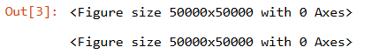
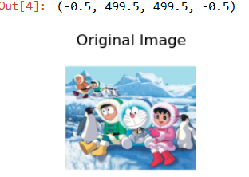
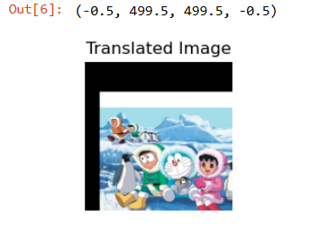
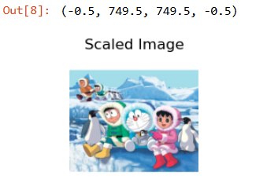
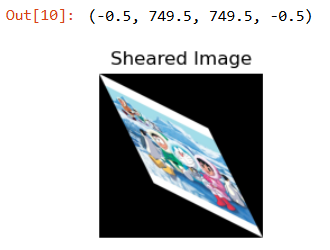
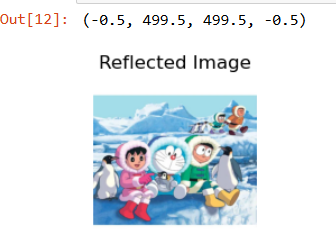
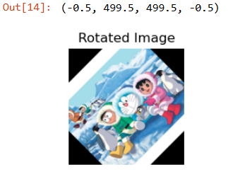
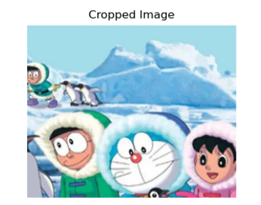

# EX-04:IMAGE-TRANSFORMATIONS

## Aim
To perform image transformation such as Translation, Scaling, Shearing, Reflection, Rotation and Cropping using OpenCV and Python.

## Software Required:
Anaconda - Python 3.7

## Algorithm:
### Step1: Initialize Environment:

Import necessary libraries: cv2, numpy, and matplotlib.pyplot.
Load the Image:

Use cv2.imread() to read the image file (e.g., "HappyFish.jpg").
Convert the image from BGR to RGB format using cv2.cvtColor() for accurate color representation in Matplotlib.
Perform Transformations:

### Step2: Translation:

Retrieve the image dimensions (rows and columns).
Create a translation matrix M_translate to shift the image by a specified number of pixels (e.g., 50 pixels right and 100 pixels down).
Apply the translation using cv2.warpAffine().
### Step3: Scaling:

Use cv2.resize() to scale the image by specified factors (e.g., 1.5 times its original size in both dimensions).
### Step4: Shearing:

Define a shearing transformation matrix M_shear with specified shear factors.
Apply shearing using cv2.warpAffine().
### Step5: Reflection (Flipping):

Use cv2.flip() to create a horizontal reflection (flip along the y-axis) of the image.
### Step6: Rotation:

Calculate the rotation matrix using cv2.getRotationMatrix2D(), specifying the center of rotation, angle (e.g., 45 degrees), and scale (1).
Apply rotation using cv2.warpAffine().
### Step7: Display the Results:

Use Matplotlib to create subplots for the original and transformed images.
Set titles for each subplot and disable axes for better visual presentation.
Adjust layout for clear viewing and show the plots.
### Step8: Optional Cropping:

(If needed) Crop a specified region of the original image using array slicing.

## Program:
```
Developed By: Ashwin Akash M
Register Number: 212223230024
```
Read An Image
```
import cv2
import numpy as np
import matplotlib.pyplot as plt
image = cv2.imread('cartoon.jpg')
image_rgb = cv2.cvtColor(image, cv2.COLOR_BGR2RGB)
```
``` 
plt.figure(figsize=(500,500))
```

```
plt.subplot(2, 3, 1)
plt.imshow(image_rgb)
plt.title("Original Image")
plt.axis('off')
```

i)Image Translation
```
rows, cols, _ = image.shape
M_translate = np.float32([[1, 0, 50], [0, 1, 100]])  
translated_image = cv2.warpAffine(image_rgb, M_translate, (cols, rows))
plt.subplot(2, 3, 2)
plt.imshow(translated_image)
plt.title("Translated Image")
plt.axis('off')
```

ii) Image Scaling

```
scaled_image = cv2.resize(image_rgb, None, fx=1.5, fy=1.5, interpolation=cv2.INTER_LINEAR)
plt.subplot(2, 3, 3)
plt.imshow(scaled_image)
plt.title("Scaled Image")
plt.axis('off')
```

iii)Image shearing
```
M_shear = np.float32([[1, 0.5, 0], [0.5, 1, 0]])
sheared_image = cv2.warpAffine(image_rgb, M_shear, (int(cols * 1.5), int(rows * 1.5)))
plt.subplot(2, 3, 4)
plt.imshow(sheared_image)
plt.title("Sheared Image")
plt.axis('off')
```

iv)Image Reflection
```
reflected_image = cv2.flip(image_rgb, 1)
plt.subplot(2, 3, 5)
plt.imshow(reflected_image)
plt.title("Reflected Image")
plt.axis('off')
```

v)Image Rotation
```
M_rotate = cv2.getRotationMatrix2D((cols / 2, rows / 2), 45, 1) 
rotated_image = cv2.warpAffine(image_rgb, M_rotate, (cols, rows))
plt.subplot(2, 3, 6)
plt.imshow(rotated_image)
plt.title("Rotated Image")
plt.axis('off')
```


vi)Image Cropping
```
cropped_image = image_rgb[50:300, 100:400] 
plt.figure(figsize=(4, 4))
plt.imshow(cropped_image)
plt.title("Cropped Image")
plt.axis('off')
plt.show()
```


## Result: 

Thus the different image transformations such as Translation, Scaling, Shearing, Reflection, Rotation and Cropping are done using OpenCV and python programming.
